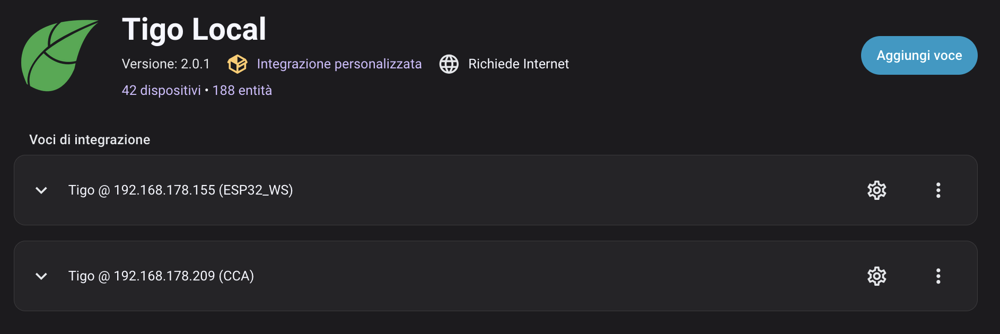
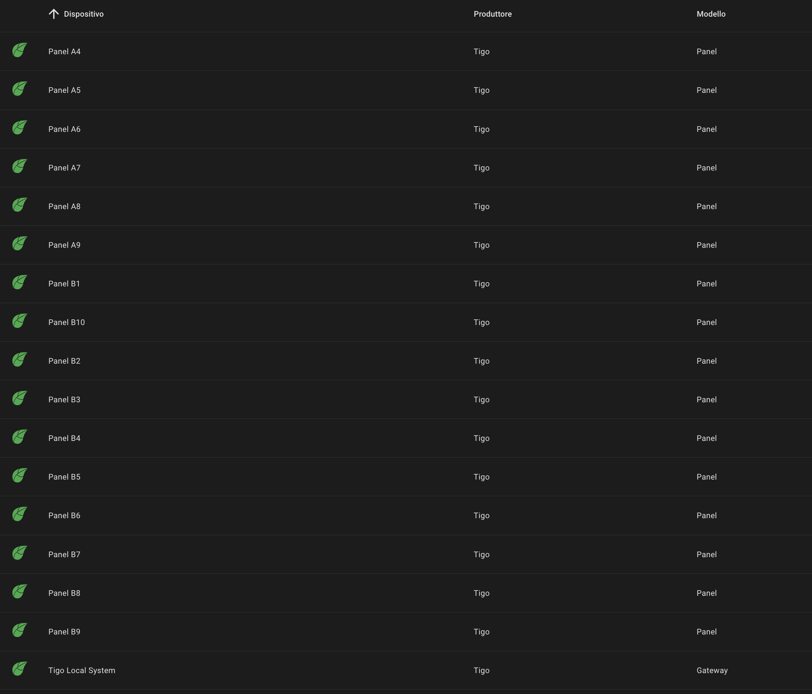
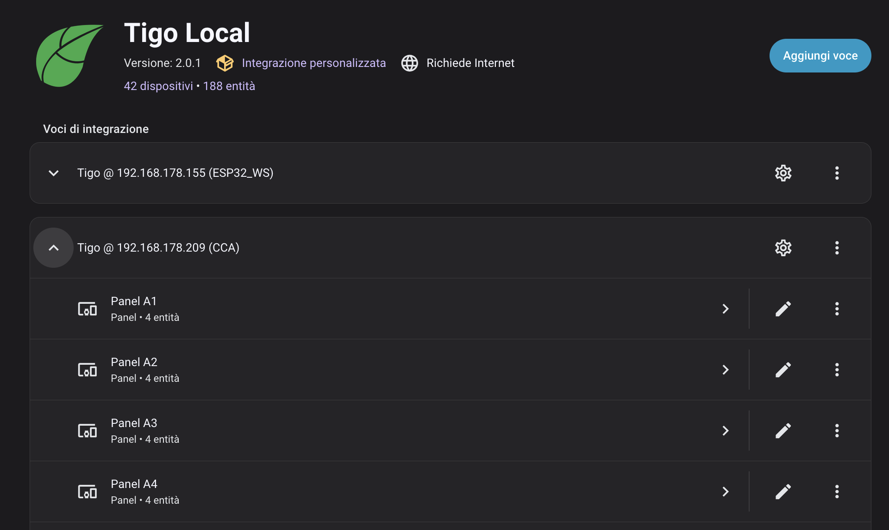
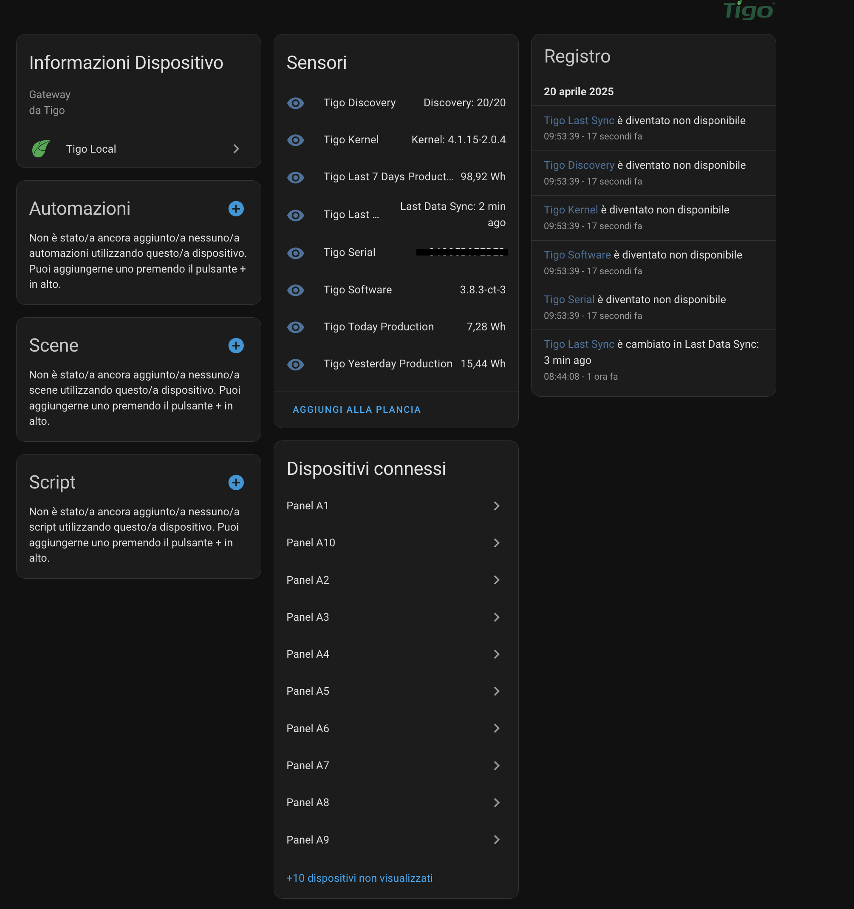

## Supportami / Support Me

Se ti piace il mio lavoro e vuoi che continui nello sviluppo delle card, puoi offrirmi un caffè.\
If you like my work and want me to continue developing the cards, you can buy me a coffee.

Non dimenticare di seguirmi sui social:\
Don't forget to follow me on social media:

# Tigo Local Integration for Home Assistant (v2)

A custom integration that connects Home Assistant to a **Tigo CCA** (Cloud Connect Advanced) or **ESP32-based Tigo panels** via the local network, without using cloud services or API keys. It fetches real-time and historical solar panel data directly from the device.

⚠️ Not compatible with Tigosolar-online

 

---

## NOTE -  IF STOP WORKING??

If the integration stops working and you can’t see any data from Tigo, you may need to update the CCA.
Open the Tigo app on your phone and move as close as possible to the CCA to establish a Bluetooth connection. Then update the CCA firmware.
Once it reboots, the integration should start working again.

## HACS

This integration can be installed manually or via HACS when available.

---

## MANUAL INSTALLATION

1. Copy the `tigo` directory into `/config/custom_components/`.

2. Restart Home Assistant.

3. Go to **Settings → Devices & Services → Add Integration**, and search for **Tigo Local**.

4. Enter the **local IP address** of your Tigo CCA or ESP32 panel (e.g., `192.168.1.100`).

> ⚠️ Do **not** include `http://` or use hostnames like `tigo.local`.

---

## 📦 Features

- Connects locally to your Tigo CCA or ESP32-based panels via IP.
- Retrieves data for **each individual panel**, including:
  - Power (W)
  - Voltage (V)
  - Current (A)
  - Temperature (°C) *(for ESP32 panels)*
  - Signal Strength (dBm)
- Organizes panels by inverter and string (CCA) or just panels (ESP32).
- **Panel display name** read live from the ESP32 firmware `panel` field (e.g. `A1`, `B6`). If the name is assigned later, the sensor title updates automatically on the next poll — no history is lost.
- **Energy sensors per panel** (Day and Month) with automatic reset at midnight / start of month and correct `last_reset` signaling to the Home Assistant Energy dashboard.
- Displays **daily and 7-day energy history** (if available, for CCA).
- No credentials required, works entirely over local HTTP access.
- Updates every 30 seconds by default (configurable).

---

## 🔗 Supported Sources

- **CCA** – Tigo Cloud Connect Advanced
- **ESP32** – ESP32-based Tigo panel monitoring firmware ([project link](https://github.com/Bobsilvio/tigo_server))

---

## 📄 Sensor Naming Convention

All sensors use a **stable, unique ID** based on source and IP to avoid entity renaming after Home Assistant restarts.

- `<source>` → `cca` or `esp`
- `<ip>` → IP address without dots, e.g., `192168178155`
- `<panel_id>` → for **CCA**: panel label (e.g. `b1`); for **ESP32**: the `addr` field from the WS (e.g. `001b`) — this never changes even if a panel name is assigned later
- `<parameter>` → `pin`, `vin`, `iin`, `temp`, `rssi`, `energy`, `energy_day`, `energy_month`

The **display name** of each ESP32 sensor (shown in the HA UI) is taken from the `panel` field of the WebSocket message (e.g. `A1`, `B6`). If that field is absent, the `addr` is used. When the name is assigned on the ESP32 later, the title updates automatically on the next poll with **no new entity created and no history lost**.

**Examples:**

- CCA Panel B1 Voltage:  
  `sensor.cca_192168178155_tigo_b1_vin`

- ESP32 Panel A1 Power (addr=001B):  
  `sensor.esp_192168178155_tigo_001b_pin` → displayed as **Panel A1 Power**

- ESP32 Panel A1 Energy Day:  
  `sensor.esp_192168178155_tigo_001b_energy_day`

- ESP32 Panel A1 Energy Month:  
  `sensor.esp_192168178155_tigo_001b_energy_month`

---

## 📸 Example Entities

### CCA Panels
- `sensor.cca_192168178155_tigo_b1_pin` → Panel B1 Power
- `sensor.cca_192168178155_tigo_b2_vin` → Panel B2 Voltage
- `sensor.cca_192168178155_tigo_system_today` → Tigo Today Production
- `sensor.cca_192168178155_tigo_system_weekly` → Tigo Last 7 Days Production

### ESP32 Panels
- `sensor.esp_192168178155_tigo_001b_pin` → Panel A1 Power
- `sensor.esp_192168178155_tigo_001b_vin` → Panel A1 Voltage
- `sensor.esp_192168178155_tigo_001b_temp` → Panel A1 Temperature
- `sensor.esp_192168178155_tigo_001b_energy` → Panel A1 Energy (TOTAL_INCREASING)
- `sensor.esp_192168178155_tigo_001b_energy_day` → Panel A1 Energy Day (resets at midnight)
- `sensor.esp_192168178155_tigo_001b_energy_month` → Panel A1 Energy Month (resets on 1st)

---

## ⚠️ Important Notes

- After updating to v2.0.0:
  - You **must recreate the integration** in Home Assistant.
  - Existing automations referencing old sensor names need to be **updated to the new naming convention**.
- ESP32 panels are supported via [this project](https://github.com/Bobsilvio/tigo_server). Only panel-level sensors are available (no CCA gateway/system info).
- CCA sensors will continue to provide inverter, string, and module information.

---

## 🙏 Credits

This project is inspired by reverse-engineering efforts and aims to bring **offline, privacy-friendly** monitoring of Tigo solar installations to Home Assistant.

---

## 📄 License

This project is licensed under the MIT License.
