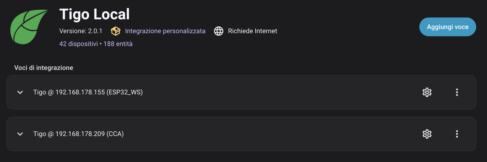
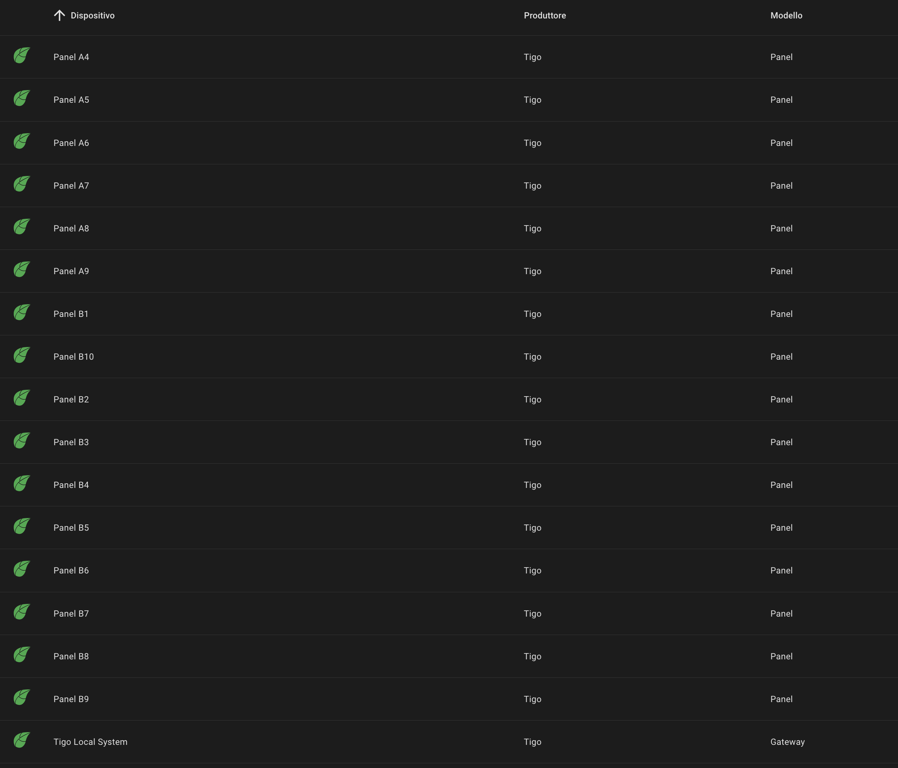
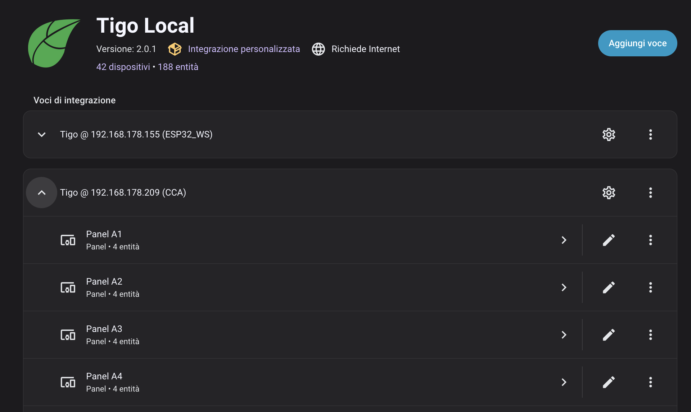
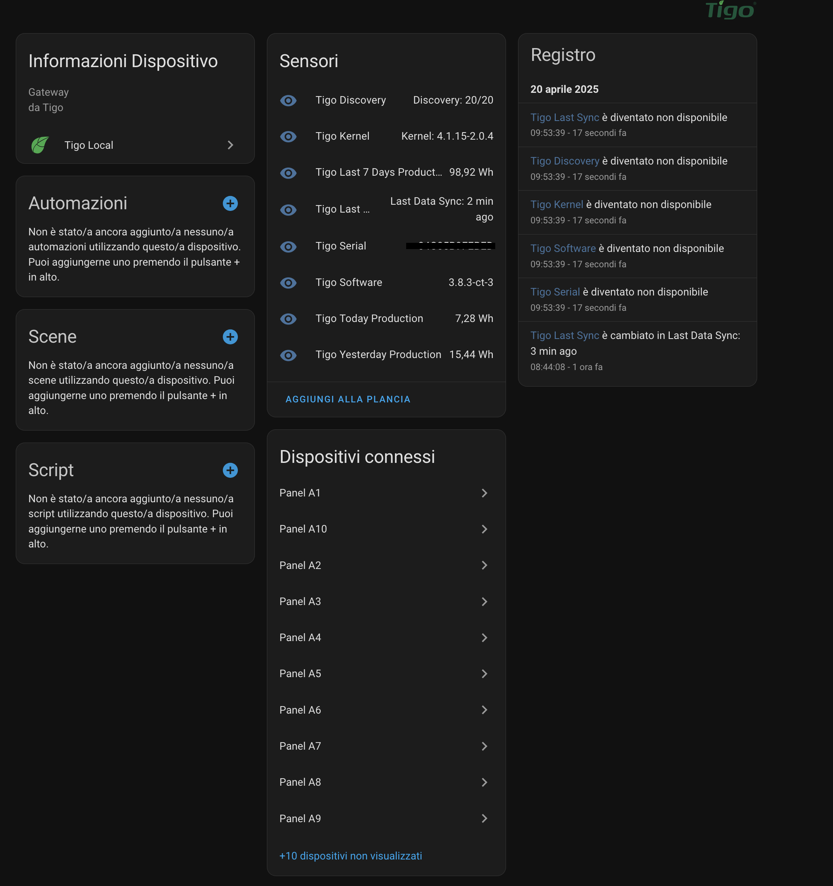

[](https://ko-fi.com/silviosmart)

## Supportami / Support Me

Se ti piace il mio lavoro e vuoi che continui nello sviluppo delle card, puoi offrirmi un caffè.\
If you like my work and want me to continue developing the cards, you can buy me a coffee.

[](https://www.paypal.com/donate/?hosted_button_id=Z6KY9V6BBZ4BN)

Non dimenticare di seguirmi sui social:\
Don't forget to follow me on social media:

[](https://www.tiktok.com/@silviosmartalexa)

[](https://www.instagram.com/silviosmartalexa)

[](https://www.youtube.com/@silviosmartalexa)

# Tigo Local Integration for Home Assistant (v2)

A custom integration that connects Home Assistant to a **Tigo CCA** (Cloud Connect Advanced) or **ESP32-based Tigo panels** via the local network, without using cloud services or API keys. It fetches real-time and historical solar panel data directly from the device.

⚠️ Not compatible with Tigosolar-online

 


---

## NOTE -  IF STOP WORKING??

If the integration stops working and you can’t see any data from Tigo, you may need to update the CCA.
Open the Tigo app on your phone and move as close as possible to the CCA to establish a Bluetooth connection. Then update the CCA firmware.
Once it reboots, the integration should start working again.

> [!IMPORTANT]
> If your CCA firmware is **>= 4.0.4**, the local endpoints are password-locked and local data is no
> longer accessible. In that case use the **Cloud source** — see [Cloud source](#cloud-source-cca-firmware--404) below.

## HACS

This integration can be installed manually or via HACS when available.

[](https://my.home-assistant.io/redirect/hacs_repository/?owner=bobsilvio&repository=tigosolar-local&category=integration)

## MANUAL INSTALLATION

1. Copy the `tigo` directory into `/config/custom_components/`.

2. Restart Home Assistant.

3. Go to **Settings → Devices & Services → Add Integration**, and search for **Tigo Local**.

4. Enter the **local IP address** of your Tigo CCA or ESP32 panel (e.g., `192.168.1.100`).
   On CCA firmware **>= 4.0.4** the setup then asks for your **Tigo account username and password**
   and uses the [Cloud source](#cloud-source-cca-firmware--404).

> [!IMPORTANT]
> Do **not** include `http://` or use hostnames like `tigo.local`.

---

## 📦 Features

- Connects locally to your Tigo CCA or ESP32-based panels via IP.
- Retrieves data for **each individual panel**, including:
  - Power (W)
  - Voltage (V)
  - Current (A)
  - Temperature (°C) *(for ESP32 panels)*
  - Signal Strength (dBm)
- Organizes panels by inverter and string (CCA) or just panels (ESP32).
- **Panel display name** read live from the ESP32 firmware `panel` field (e.g. `A1`, `B6`). If the name is assigned later, the sensor title updates automatically on the next poll — no history is lost.
- **Energy sensors per panel** (Day and Month) with automatic reset at midnight / start of month and correct `last_reset` signaling to the Home Assistant Energy dashboard.
- Displays **daily and 7-day energy history** (if available, for CCA).
- No credentials required, works entirely over local HTTP access.
- Updates every 30 seconds by default (configurable).

---

## 🔗 Supported Sources

- **CCA** – Tigo Cloud Connect Advanced (local)
- **ESP32** – ESP32-based Tigo panel monitoring firmware ([project link](https://github.com/Bobsilvio/tigo_server))
- **Cloud** – Tigo account (`mapi.tigoenergy.com`), used when the CCA firmware (>= 4.0.4) password-locks the local endpoints

---

## Cloud source (CCA firmware >= 4.0.4)

Newer CCA firmware (**>= 4.0.4**) password-locks the local `/cgi-bin` endpoints, so the old
`Tigo` / `$olar` credentials stop working and local data becomes unreachable.

To keep the integration working, a **third source** was added. During setup you still enter the
local IP first: the integration **automatically detects the firmware** and, if the local data is
locked, it asks for your **Tigo account username and password** and switches to the cloud source
(replicating what the official Tigo app does). If it doesn't switch automatically, tick the
**"Force cloud"** checkbox in the first setup step.

> [!NOTE]
> This is a **workaround**. On a Basic (non-premium) Tigo account the cloud exposes, **per panel**,
> only **Power (W)**, **Energy Today (kWh)** and **Reclaimed Power (W)** — not voltage/current/
> temperature/RSSI. System totals (current/peak power, day/week/month/year/lifetime energy,
> reclaimed) are available too.

> [!WARNING]
> Cloud data is **not real-time**. The per-panel series is published in **15-minute** slots and the
> CCA→cloud upload happens every ~10–15 min, so values can lag by several minutes. The cloud source
> therefore polls every **5 minutes by default** (minimum 120 s) to stay well under the API rate
> limit — polling faster does **not** give fresher data.

 

---

## 📄 Sensor Naming Convention

The `entity_id` is generated automatically by Home Assistant from the **entity name**, which follows this pattern:

```
Panel <label> <parameter>
```

- `<label>` → for **CCA**: the panel label from the layout (e.g. `A2`, `B1`); for **ESP32**: the `panel` field from the WebSocket (e.g. `A1`, `B6`), or the `addr` if no name is assigned yet (e.g. `001B`)
- `<parameter>` → `Power`, `Voltage`, `Current`, `Temperature`, `Signal Strength`, `Energy`, `Energy Day`, `Energy Month`

The **unique_id** (internal, never changes) is based on source + IP + `addr`/panel_id, so renaming a panel on the ESP32 later updates only the display name — **no new entity is created, history is preserved**.

**Examples:**

- CCA Panel A2 Current:  
  `sensor.panel_a2_current`

- ESP32 Panel with addr `001B` (no name assigned yet):  
  `sensor.panel_001b_current`

- ESP32 Panel A1 (name assigned, addr `001B`):  
  `sensor.panel_a1_current`

- ESP32 Panel A1 Energy Day:  
  `sensor.panel_a1_energy_day`

- ESP32 Panel A1 Energy Month:  
  `sensor.panel_a1_energy_month`

---

## 📸 Example Entities

### CCA Panels
- `sensor.panel_b1_power` → Panel B1 Power
- `sensor.panel_b2_voltage` → Panel B2 Voltage
- `sensor.panel_a2_current` → Panel A2 Current
- `sensor.tigo_today_production` → Tigo Today Production
- `sensor.tigo_last_7_days_production` → Tigo Last 7 Days Production

### ESP32 Panels
- `sensor.panel_a1_power` → Panel A1 Power
- `sensor.panel_a1_voltage` → Panel A1 Voltage
- `sensor.panel_a1_current` → Panel A1 Current
- `sensor.panel_a1_temperature` → Panel A1 Temperature
- `sensor.panel_a1_energy` → Panel A1 Energy (cumulative, TOTAL_INCREASING)
- `sensor.panel_a1_energy_day` → Panel A1 Energy Day (resets at midnight)
- `sensor.panel_a1_energy_month` → Panel A1 Energy Month (resets on 1st)

> **Note:** if the panel has no name yet, `A1` is replaced by the `addr` value, e.g. `sensor.panel_001b_power`.

---

## ⚠️ Important Notes

- After updating to v2.0.0:
  - You **must recreate the integration** in Home Assistant.
  - Existing automations referencing old sensor names need to be **updated to the new naming convention**.
- ESP32 panels are supported via [this project](https://github.com/Bobsilvio/tigo_server). Only panel-level sensors are available (no CCA gateway/system info).
- CCA sensors will continue to provide inverter, string, and module information.

---

## 🙏 Credits

This project is inspired by reverse-engineering efforts and aims to bring **offline, privacy-friendly** monitoring of Tigo solar installations to Home Assistant.

---

## 📄 License

This project is licensed under the [MIT License](LICENSE).
