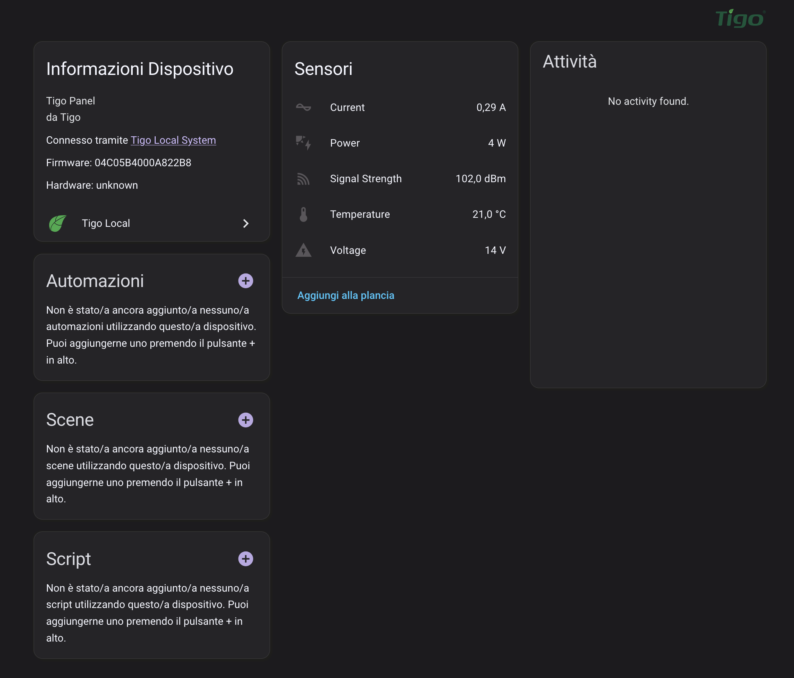

## Supportami / Support Me

Se ti piace il mio lavoro e vuoi che continui nello sviluppo delle card, puoi offrirmi un caffè.\
If you like my work and want me to continue developing the cards, you can buy me a coffee.

Non dimenticare di seguirmi sui social:\
Don't forget to follow me on social media:

# Tigo Local Integration for Home Assistant (v2)

A custom integration that connects Home Assistant to a **Tigo CCA** (Cloud Connect Advanced) or **ESP32-based Tigo panels** via the local network, without using cloud services or API keys. It fetches real-time and historical solar panel data directly from the device.

⚠️ Not compatible with Tigosolar-online

 

---

## NOTE -  IF STOP WORKING??

If the integration stops working and you can’t see any data from Tigo, you may need to update the CCA.
Open the Tigo app on your phone and move as close as possible to the CCA to establish a Bluetooth connection. Then update the CCA firmware.
Once it reboots, the integration should start working again.

## HACS

This integration can be installed manually or via HACS when available.

---

## MANUAL INSTALLATION

1. Copy the `tigo` directory into `/config/custom_components/`.

2. Restart Home Assistant.

3. Go to **Settings → Devices & Services → Add Integration**, and search for **Tigo Local**.

4. Enter the **local IP address** of your Tigo CCA or ESP32 panel (e.g., `192.168.1.100`).

> ⚠️ Do **not** include `http://` or use hostnames like `tigo.local`.

---

## 📦 Features

- Connects locally to your Tigo CCA or ESP32-based panels via IP.
- Retrieves data for **each individual panel**, including:
  - Power (W)
  - Voltage (V)
  - Current (A)
  - Temperature (°C) *(for ESP32 panels)*
  - Signal Strength (dBm)
- Organizes panels by inverter and string (CCA) or just panels (ESP32).
- Displays **daily and 7-day energy history** (if available, for CCA).
- No credentials required, works entirely over local HTTP access.
- Updates every 1 minute (real-time info).

---

## 🔗 Supported Sources

- **CCA** – Tigo Cloud Connect Advanced
- **ESP32** – ESP32-based Tigo panel monitoring firmware ([project link](https://github.com/Bobsilvio/tigo_server))

---

## 📄 Sensor Naming Convention

All sensors now use a **stable, unique ID** based on source and IP to avoid switching after Home Assistant restarts.

- `<source>` → `cca` or `esp`
- `<ip>` → IP address without dots, e.g., `192168178209`
- `<panel_id>` → panel identifier, e.g., `b1` or `2`
- `<parameter>` → `power`, `voltage`, `current`, `temp`, `signal`

**Examples:**

- CCA Panel B1 Voltage:  
  `sensor.cca_192168178209_panel_b1_voltage`

- ESP32 Panel 2 Current:  
  `sensor.esp_192168150_panel_2_current`

- CCA Total Daily Energy:  
  `sensor.cca_192168178209_daily_energy`

- ESP32 Panel Temperature:  
  `sensor.esp_192168150_panel_2_temp`

---

## 📸 Example Entities

### CCA Panels
- `sensor.cca_192168178209_panel_b1_power`
- `sensor.cca_192168178209_panel_b2_voltage`
- `sensor.cca_192168178209_daily_energy`
- `sensor.cca_192168178209_weekly_energy`

### ESP32 Panels
- `sensor.esp_192168150_panel_1_power`
- `sensor.esp_192168150_panel_2_voltage`
- `sensor.esp_192168150_panel_2_temp`

---

## ⚠️ Important Notes

- After updating to v2.0.0:
  - You **must recreate the integration** in Home Assistant.
  - Existing automations referencing old sensor names need to be **updated to the new naming convention**.
- ESP32 panels are supported via [this project](https://github.com/Bobsilvio/tigo_server). Only panel-level sensors are available (no CCA gateway/system info).
- CCA sensors will continue to provide inverter, string, and module information.

---

## 🙏 Credits

This project is inspired by reverse-engineering efforts and aims to bring **offline, privacy-friendly** monitoring of Tigo solar installations to Home Assistant.

---

## 📄 License

This project is licensed under the MIT License.
